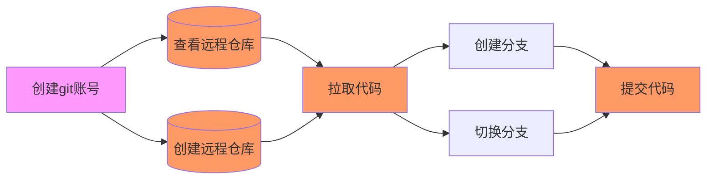

# git 使用说明

[git 官网](https://git-scm.com/)
[中文git文档](https://git-scm.com/book/zh/v2)

## `git`操作基本流程

## `git`基本流程

Git 有三种状态，你的文件可能处于其中之一： 已提交（committed）、已修改（modified） 和 已暂存（staged）。

基本的 Git 工作流程如下：

1. 在工作区中修改文件。
2. 将你想要下次提交的更改选择性地暂存，这样只会将更改的部分添加到暂存区。
3. 提交更新，找到暂存区的文件，将快照永久性存储到 Git 目录。

## `git`常用配置

`git config user.name`  //查看当前登录账号
`git config user.email` //查看当前登录邮箱
`git config --global user.name "Your_username"`  //修改用户名和邮箱
`git config --global user.email "Your_email"`  //修改用户名和邮箱

## 远程仓库的使用
`git clone https://github.com/huangpiaofighting/interview.git` //克隆现有的仓库
`git remote`    //查看远程仓库
`git remote -v`    //查看远程仓库 -v会显示需要读写远程仓库使用的 Git 保存的简写与其对应的 URL
`git remote add <remotename> <url>` //添加remotename 仓库
`git remote rm <remotename>` //移除remotename 仓库
`git remote rename <shortname> <othershortname>` //对仓库重新命名
`git fetch <remotename> ` //拉取shortname 仓库 ps:shortname已和URL做了映射
`git push <remotename> <branchname>` //推送到远程仓库

## 本地操作
`git status` //查看当前git状态
`git add file` //跟踪新文件
`git rm  file` //移除跟踪文件
`git commit -m <commitcontent>` //提交文件
`git commit -a -m <commitcontent>` //-a跳过使用暂存区域的方式提交
`git commit --amend` //撤销操作
`git log > test.log` //打印日志

## 分支的使用

`git branch` //查看分支
`git branch <branchname>` //创建分支 git branch 命令仅仅 创建 一个新分支，并不会自动切换到新分支中去
`git log --oneline --decorate` //查看各个分支当前所指的对象
`git checkout <branchname>` //分支切换
`git branch -d <branchname>` //删除分支
`git branch -D` //强制删除分支
`git merge <branchname>` 合并分支

## 其他说明

### 拉取代码需要输入用户名密码

[在github中创建token作为密码](https://docs.github.com/en/authentication/keeping-your-account-and-data-secure/creating-a-personal-access-token)

