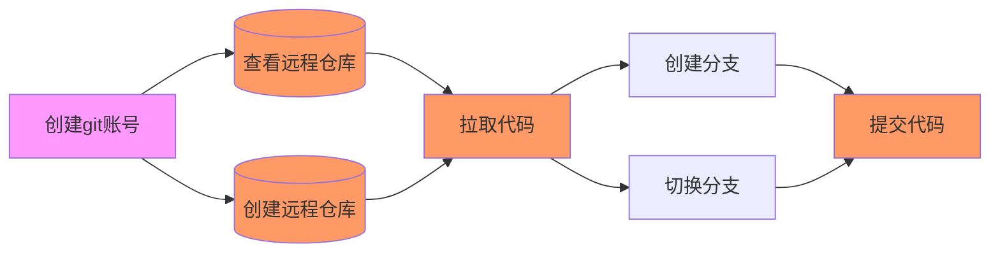

# git 使用说明

[git 官网](https://git-scm.com/)
[中文git文档](https://git-scm.com/book/zh/v2)

## `git`操作基本流程

## `git`基本流程

Git 有三种状态，你的文件可能处于其中之一： 已提交（committed）、已修改（modified） 和 已暂存（staged）。

基本的 Git 工作流程如下：

1. 在工作区中修改文件。
2. 将你想要下次提交的更改选择性地暂存，这样只会将更改的部分添加到暂存区。
3. 提交更新，找到暂存区的文件，将快照永久性存储到 Git 目录。

## `git`常用命令

`git config user.name`  //查看当前登录账号
`git config user.email` //查看当前登录邮箱
`git config --global user.name "Your_username"`  //修改用户名和邮箱
`git config --global user.email "Your_email"`  //修改用户名和邮箱

## 查看远程仓库

`git remote`    //查看远程仓库
`git remote -v`    //查看远程仓库 -v会显示需要读写远程仓库使用的 Git 保存的简写与其对应的 URL

## 添加远程仓库

`git remote add <shortname> <url>` //添加shortname 仓库

## 拉取仓库代码

`git fetch <shortname> ` //拉取shortname 仓库 ps:shortname已和URL做了映射

### 拉取代码需要输入用户名密码

[在github中创建token作为密码](https://docs.github.com/en/authentication/keeping-your-account-and-data-secure/creating-a-personal-access-token)

## 分支创建

`git branch XX` //创建分支

